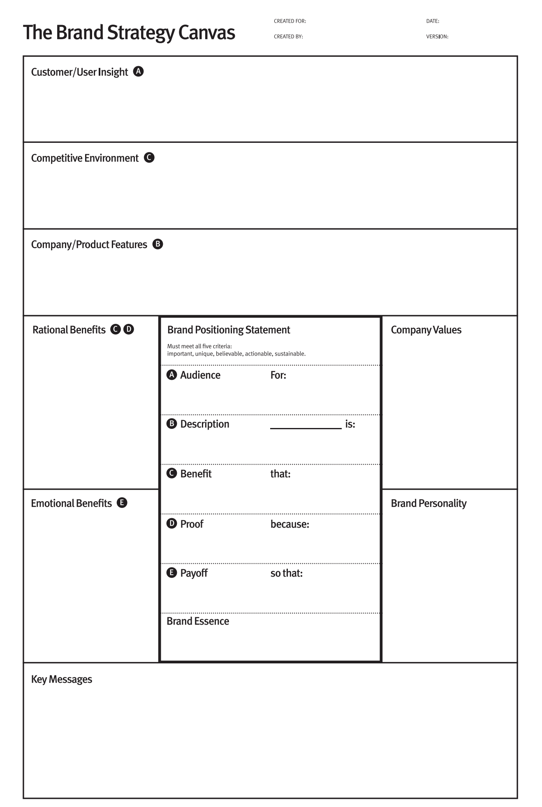

# Brand Strategy Canvas — Claude Code Plugin

An interactive brand strategy coach for early-stage startup founders, built as a Claude Code plugin. Based on the book *[The Brand Strategy Canvas](https://www.amazon.com/Brand-Strategy-Canvas-One-Page-Startups/dp/148425158X)* by [Patrick Woods](https://www.patrickwoods.com/). Learn more at [thebrandstrategycanvas.com](https://www.thebrandstrategycanvas.com/). 

## What It Does

This plugin guides founders through the 9-box Brand Strategy Canvas — a structured framework for building brand strategy *before* jumping to logos, taglines, and websites.

A single `/brand-canvas` command routes intelligently based on your current state: starting fresh, picking up where you left off, or reviewing a completed canvas. When you're done, you'll have two files saved to your project directory:

- **`brand-canvas.md`** — the full strategic document
- **`brand-canvas.excalidraw`** — a visual layout of all 9 boxes; drag into [excalidraw.com](https://excalidraw.com) to see how everything fits together



## When to Use This

The framework is designed for founders at or approaching product-market fit. Pre-PMF, the plugin will flag this and recommend a lighter-weight path.

## Installation

### From GitHub (recommended)

First, add this repo as a marketplace:

```bash
/plugin marketplace add patrickjwoods/brand-canvas-plugin
```

Then install the plugin:

```bash
/plugin install brand-canvas@patrickjwoods/brand-canvas-plugin
```

### For local testing

Clone the repo and point Claude Code at it directly:

```bash
git clone https://github.com/patrickjwoods/brand-canvas-plugin
claude --plugin-dir ./brand-canvas-plugin
```

## Usage

### Start or continue your canvas

```
/brand-canvas
```

Auto-detects your current state and routes to the right section.

### Jump to a specific section

```
/brand-canvas opportunity   # Market Opportunity (boxes A, B, C)
/brand-canvas benefits      # Rational & Emotional Benefits
/brand-canvas position      # Positioning Statement & Brand Essence
/brand-canvas voice         # Values, Personality, Key Messages
```

### Start a new version

```
/brand-canvas new
```

Archives your current canvas with a version stamp and starts fresh.

## What you'll work on and what you'll get 

Each section builds on the last and feeds directly into what comes next.

### 01 — Market Opportunity *(Boxes A, B, C)*

- **Customer / User Insight** — A precise portrait of who you're building for — not a demographic checkbox, but a real understanding of how they think, what they fear, and what they're trying to become.
- **Competitive Environment** — Map the landscape: what alternatives exist, how they position themselves, and where the white space is. The anti-audience exercise clarifies who you're explicitly not for.
- **Company / Product Features** — What your product actually does. This is the raw material — before benefits, before emotion, before story.

### 02 — Benefits *(Rational + Emotional)*

- **Rational Benefits** — How customers experience your features — not what it does, but what it means for them. The first step up the Ladder of Abstraction.
- **Emotional Benefits** — The higher-order payoff. This is where most startups stop — which is exactly why it's the biggest differentiation opportunity on the canvas.

### 03 — Positioning *(Statement + Essence)*

- **Positioning Statement** — One sentence. Who you're for, what you offer, why it matters. Every box above this one exists to make this sentence true.
- **Brand Essence** — 2–4 words that distill the whole statement. Short enough to remember. Clear enough to make decisions from.

### 04 — Voice & Expression *(Values, Personality, Key Messages)*

- **Values** — Internal guide rails, not marketing copy. The nouns that describe what your company genuinely believes and how it makes decisions.
- **Personality** — How your brand shows up in the world. Characterful, not generic. The outward expression of everything your values say internally.
- **Key Messages** — 3–5 concepts you communicate consistently, each backed by proof points. Apply the Talk Like a Human test before you're done.

Each section is coached interactively — the plugin asks questions, waits for your answers, and helps you synthesize before writing anything to the canvas.

## About

Created by [Patrick Woods](https://patrickwoods.com). Questions or feedback: [@patrickjwoods](https://twitter.com/patrickjwoods).

Learn more about the framework at [thebrandstrategycanvas.com](https://thebrandstrategycanvas.com) or pick up the book: *[The Brand Strategy Canvas](https://www.amazon.com/Brand-Strategy-Canvas-One-Page-Startups/dp/148425158X)* (Apress).
